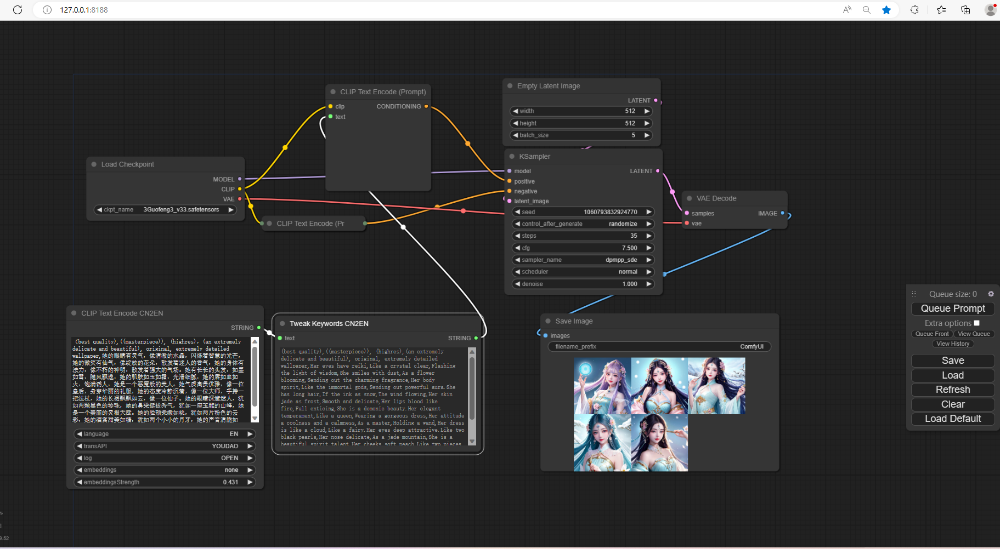
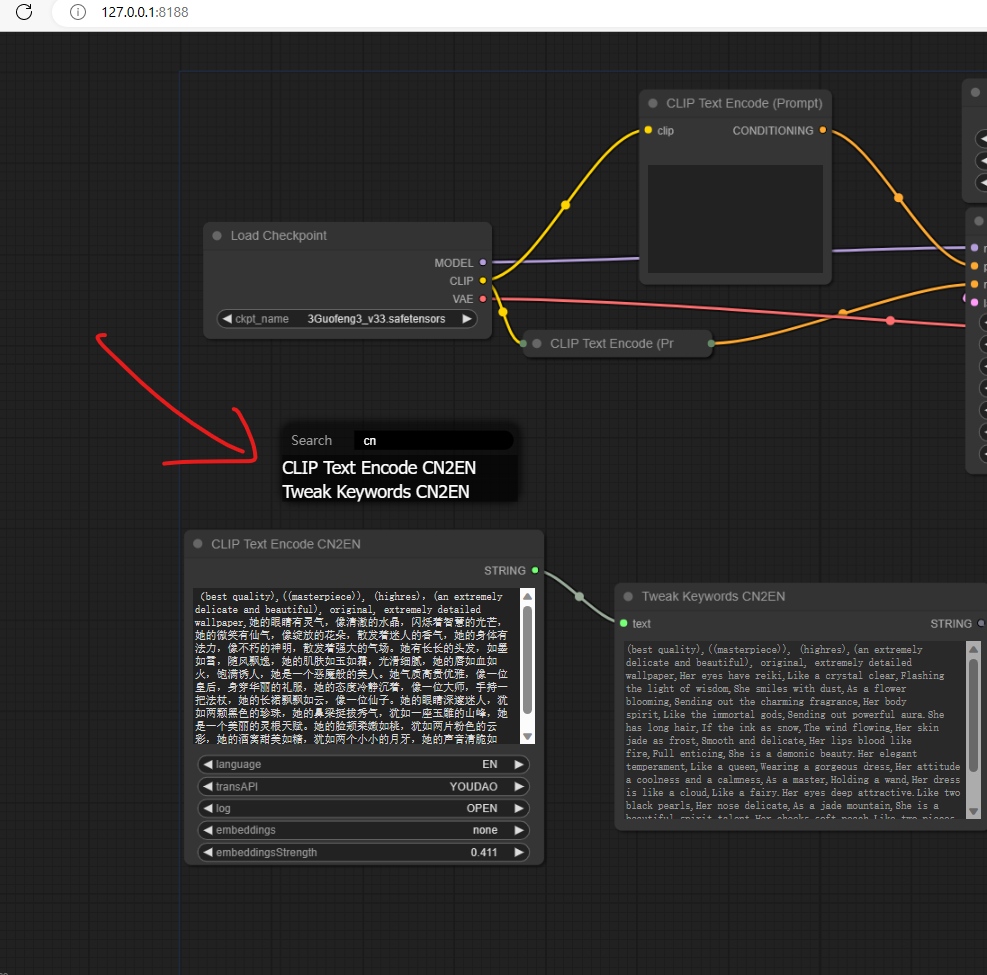
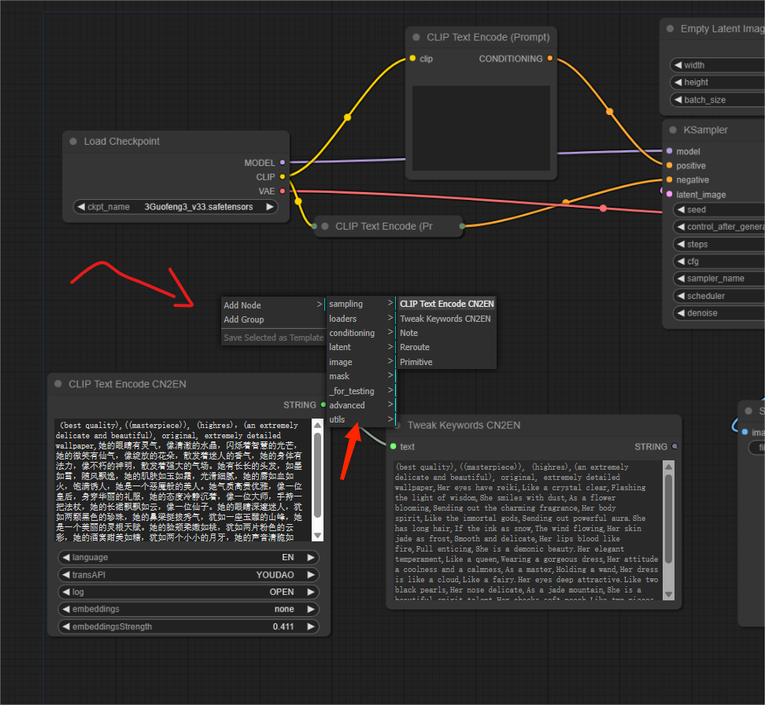
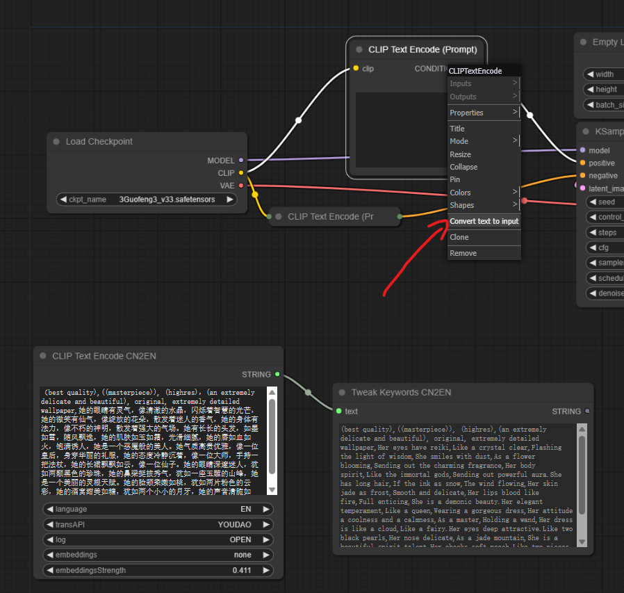
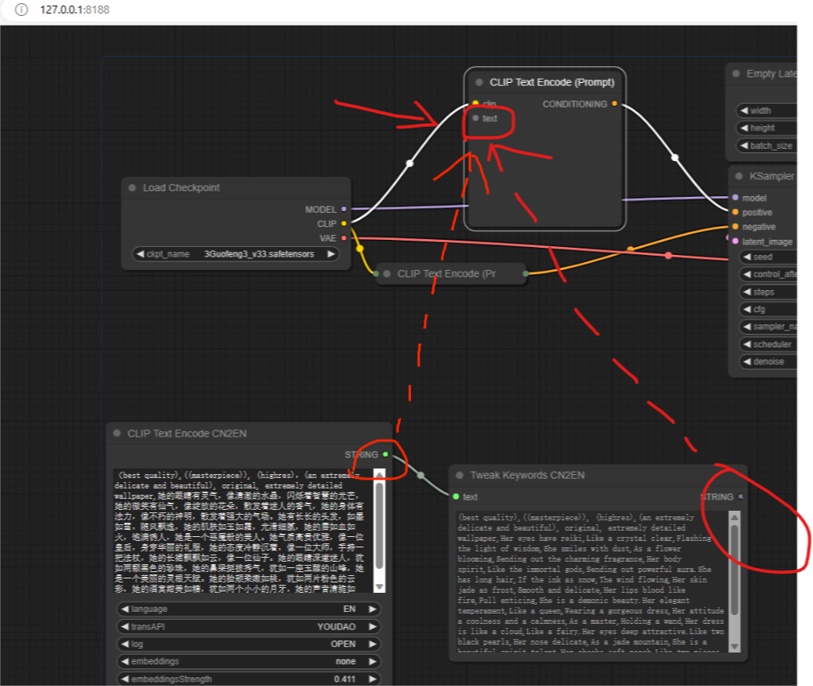
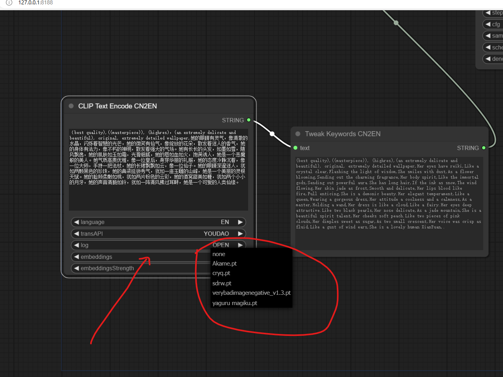

# comfy_translation_node
更新--2023 04 24
本次更新功能无变动，只是做了一个小改动调整了节点的分组，统一放到xww-trans里，如果你之前有下载的可以不用更新，要更新的话，如果你有使用openIE.txt，请先备份openIE.txt再更新，如果没使用直接覆盖comfy_translation_node就可以了

# 描述

### 可以在[ComfyUI](https://github.com/comfyanonymous/ComfyUI)界面上使用节点进行翻译，汉英互译，支持有道和谷歌api翻译，多种选项任你选择；
### CLIP Text Encode CN2EN：支持：翻译api切换、是否打开翻译、汉英切换、 embeddings选择，embeddings权重调节；
### Tweak Keywords CN2EN：可以自由调整翻译后的内容，更灵活的对你的关键词进行优化

# 一、下载

## git clone
```
    git clone https://github.com/laojingwei/comfy_translation_node.git
```

## ZIP
[ZIP下载](https://github.com/laojingwei/comfy_translation_node/archive/refs/heads/main.zip)


## 二、位置安装及使用前操作
#### 1.把下载好的文件夹 *comfy_translation_node* 放到 *ComfyUI\custom_nodes* 下
#### 2.如果你想在启动[ComfyUI](https://github.com/comfyanonymous/ComfyUI)时使用你想要的浏览器（只想使用默认浏览器这一步可跳过），可以编辑 *openIE.txt*（路径：ComfyUI\custom_nodes\comfy_translation_node\openIE.txt） 里的 *PATH* 字段，添加对应浏览器的.exe执行文件路径上去即可，如：PATH="C:\Program Files (x86)\Microsoft\Edge\Application\msedge.exe"，其它字段（ *PATHOLD，SAVE*）千万千万千万不要去动，不管他们是什么值都不要去动！（如果更新ComfyUI代码后失效，这时才需要去把其它两个字段重置为 *PATHOLD=""* 和 *SAVE="FALSE"*
#### 3.回到ComfyUI的更新文件夹*ComfyUI_windows_portable\update* ，里面的三个文件按顺序执行一遍，因为本插件需要最新的[ComfyUI](https://github.com/comfyanonymous/ComfyUI)代码，不更新没法使用，如果你已是最新的（2023-04-15之后有更新的）这一步你可跳过
#### 4.回到根目录双击run_nvidia_gpu.bat（或run_cpu.bat）启动ComfyUI；注意，如果你有执行上面的第2步，那么你需要关闭ComfyUI启动器重新再启动一遍，因为第一遍启动时只是初始化了浏览器的路径，没法读取到，需要再一次启动就能打开你想要的浏览器了，以后只要你不更新ComfyUI代码，均可每次都能打开你的浏览器，如果你有后面有更新，那么需要你在更新代码后起两次服务才生效


# 三、使用说明
## 1.节点添加方式：可通过双击进入搜索输出相关单词查找或右键找到utils点击进去查找，这两个节点均可直接连接到CLIP Text Encode的text上，CLIP Text Encode接受文本入口，text入口可在CLIP Text Encode上右键，找到Convert text to input，进行选择左边就会出现text入口（这一步非常重要，很多节点都可以通过这样的方式打开text入口）
## 2.CLIP Text Encode CN2EN
```
    文本输入框：输入关键词
    "language": 'AUTO'不进行翻译，原文输出,'CN'转义成中文（注意了，由于翻译api的原因，请保证为纯英文才会转中文）,'EN'转义为英文（可中英混合）
    "transAPI": 'YOUDAO'使用有道api翻译,'GOOGLE'使用谷歌api翻译
                (谷歌调用时间较慢，一般2秒左右，有时也会调用失败，建议使用有道翻译，速度飞快，不过不同翻译api翻译出来的内容是有一点点不一样的，
                选哪个看自己喜好了)
    "log": 'CLOSE'在控制台不打印日志,'OPEN'在控制台打印日志
    "embeddings": 'none'不使用，其它：选择你想要的模型（如果embeddings文件夹里没有模型，embeddings和embeddingsStrength是不展示出来的）
    "embeddingsStrength": 权重设置,
```
## 3.Tweak Keywords CN2EN
```
    展示输入内容，可配合CLIP Text Encode CN2EN展示翻译后的内容出来；
    由于翻译api的局限性，翻译出来的格式可能会有点问题，有必要的话你可以在这里进行修正；
    如果你觉得翻译出来的某些单词不是你想要的，你可以对具体单词进行编辑，这可以让你的关键词变得更完美，生成更好的图片
    如果更新ComfyUI代码后，tweak_keywords_CN2EN节点没法查看内容，先查看ComfyUI\web\extensions路径下是否有这个文件夹tweak_keywords_CN2EN，
    或里面内容是否为空，如果是可以解压这个tweak_keywords_CN2EN.zip（路径：ComfyUI\custom_nodes\comfy_translation_node\tweak_keywords_CN2EN.zip），
    手动把他放到ComfyUI\web\extensions里（一般情况是不会被覆盖的，给大家一个压缩包是为了以防万一）
```

# 四、使用截图

## 结果图


## 完整流程



## 节点添加方式





## CLIP Text Encode打开text输入



## 节点连接



## embeddings选项



# 五、其它
1.这里说一下默认浏览器修改的，由于原ComfyUI打开浏览器的方法编写原因，在程序运行中无法去重写他的方法，已沟通原制作者是否可以调整一下他们的代码还未收到反馈，目前我的做法是直接去硬修改他们的代码 *（由于本人对python不熟，没学过，只能慢慢研究他们的代码，目前以我的能力能想到的办法就是直接去修改他们的代码了，我知道这样对于一段好的代码是非常糟糕的；之前我写过一个非节点的翻译插件[comfy_Translation](https://github.com/laojingwei/comfy_Translation)，那里的方式是每次都打开两个浏览器，这体验很不好）*，由于这里是硬修改代码，只要每次更新ComfyUI代码就会覆盖掉，所以才会出现上面说的如果是第一次运行这插件或有更新代码，都需要启动两遍服务；如果有哪位大神知道更好的去处理的话不知能否传授一下技能点我

2.Tweak Keywords CN2EN的写法是借鉴了[show text](https://github.com/pythongosssss/ComfyUI-Custom-Scripts/tree/main/show-text)这个插件的，非常感谢[pythongosssss](https://github.com/pythongosssss)提供了这么好的思路给我

3.我在考虑要不要把一些常用的tag也放上去，因为在sd-webui上有好多好用的tag插件，也能存储自己的tag，很方便大家使用，不用再四处寻找好的tag

4.如果在使用过程中有什么问题请及时沟通我

5.大家如果有好的想法也可以提出来，我会尽最大努力去实现的
